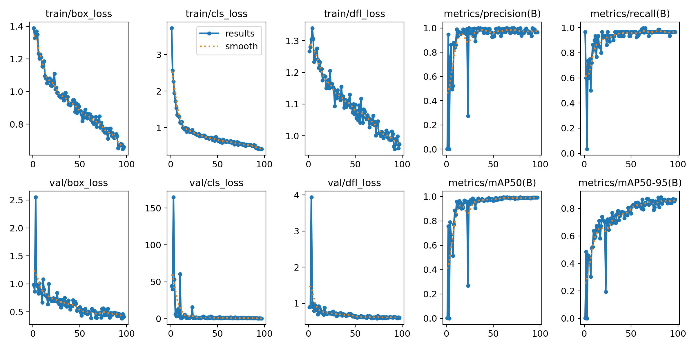
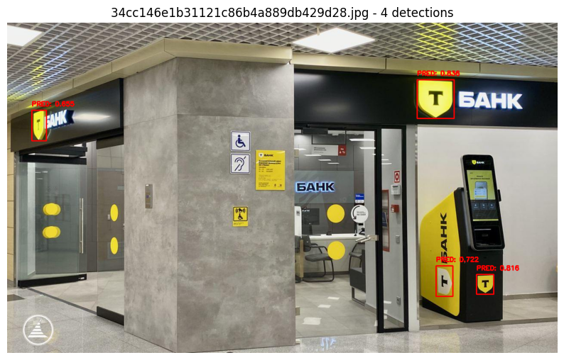
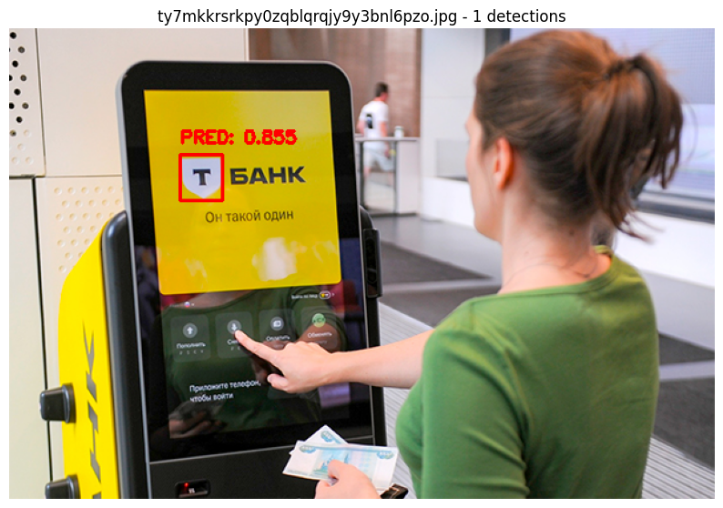
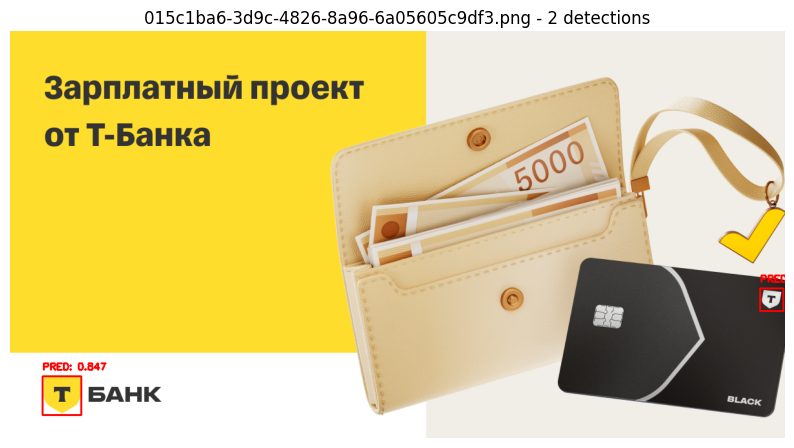
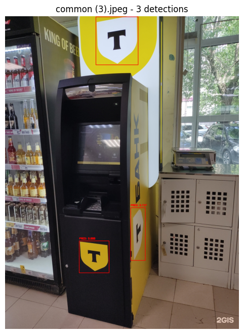

# TBank Logo Detector API


## Описание и ход решения задачи

REST API сервис детектирующий новые логотипы Т-Банка. Изначально главной задачей предстояло разметить большой датасет от органзиторов *( 30k samples )*. В нем было довольно большое количество Negative примеров без логотипа Т-Банка, zero-shot подходы **( Grouding Dino )** показывали довольно низкое качество разметки, поэтому решением стала ручная разметка ~ 200 примеров собранных при помощи парсера с Google Картинок по запросу "Новое лого Т-Банк", для повышения качества в процессе экспериментов, я взял еще около 100 фотографий из различных доменов *( банкоматы, лого в помещении, маленькие лого)* — [Roboflow](https://universe.roboflow.com/testfirst-ejwza/tbank-logo-wqdc2/dataset/3)

Для обогащеня датасета и валидации был взят другой датасет из открытых истоников:

[Roboflow](https://universe.roboflow.com/kravigo/t-bank-logo-detection-ragel/dataset/5)

Получившийся итоговый датасет можно найти в Google Drive  [dataset_tlogo.zip](https://drive.google.com/drive/folders/1ktITHSFWbCF0kaPL5USOAZVN0kV8Fbe7?usp=sharing)

*Train ~ 600 samples* |
*Val ~ 350 samples* 

Главной моделью для решения задачи стала последняя **YOLO v12n** с использованием различных аугментаций. Пайплайн обучения, с комментариями и метриками на валидации описан в файле: [yolov12.ipynb](yolov12.ipynb) 

Лог эксперимента в ClearML : [Необходима авторизация](https://app.clear.ml/projects/a2fcd9f4c6af455c8ed9db5c4af4886e/experiments/0c3a44e3bf564c8082f316a1b71022ab/output/execution)

## Метрики обучения



## Метрики валидации

| Метрика            | Значение                                 |
|--------------------|------------------------------------------|
| Датасет (val)      | 354 изображений                           |
| Precision (P)      | 0.966                                     |
| Recall (R)         | 0.967                                     |
| mAP@0.50           | 0.990                                     |
| mAP@0.50:0.95      | 0.881                                     |

| Параметр                 | Значение                                             |
|--------------------------|------------------------------------------------------|
| Модель                   | YOLOv12n (159 слоёв, 2.56M параметров, 6.3 GFLOPs)  |
| Время на изображение     | 0.6 ms preprocess, 13.7 ms inference, 2.4 ms postprocess |
| Устройство               | Tesla T4 (16 GB)                                     |
| Путь с результатами      | `/content/runs/detect/tbank_logo_v122`               |
| Лучшие веса              | `runs/detect/tbank_logo_v12/weights/best.pt`         |

## Примеры детекций:






## Требования
- Docker установлен
- Веса модели по пути `Runs/tbank_logo_v12/weights/best.pt`

## Сборка
```bash
docker build --network=host -t tbank-logo-detector .
```

## Запуск
```bash
docker run --rm -p 8000:8000 tbank-logo-detector
```

## Тест
```bash
curl -X POST "http://localhost:8000/detect" \
  -H "accept: application/json" \
  -H "Content-Type: multipart/form-data" \
  -F "file=@/path/to/image.jpg"
```

## Docs
Откройте `http://localhost:8000/docs`.


### Предложения альтернативных подходов
Текущее решение уже показывает довольно неплохие метрики на представленном валидационном датасете. Альтернативный подход можно использовать в сборе данных , возможно, с текущей моделью можно еще улучшить качество используя на ее основе предварительную разметку для обогащения тренировчного датасета.

### Анализ проблем и пути решения
На данном этапе основной проблемой решения является малое разнообразие тренировочных данных, из-за чего модель склонна ошибаться в искаженных/перекрытых и маленьких логотипах. Результат можно улучшить уже на текущем наборе данных используя болеее тонкие техники аугментации, но все же стоит использовать дообучение на «трудных» доменах (банкоматы, наружная реклама, мелкие/наклонные логотипы) для улучшения обобщающей способности модели. Также стоит попробовать взять большую модель и увеличить *image size* изображения для лучшего качества детекции на маленьких логотипах.

### Производительность и ускорение
 **Текущая скорость (T4)**: ~0.6 ms препроцесс, ~13.7 ms инференс, ~2.4 ms постпроцесс на изображение — существенно ниже ограничения (≤10 с).

  Можно попробовать FP16 на GPU: `device=0`, `torch.cuda.amp.autocast`/автонастройка Ultralytics.
